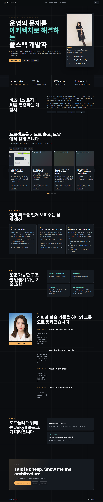
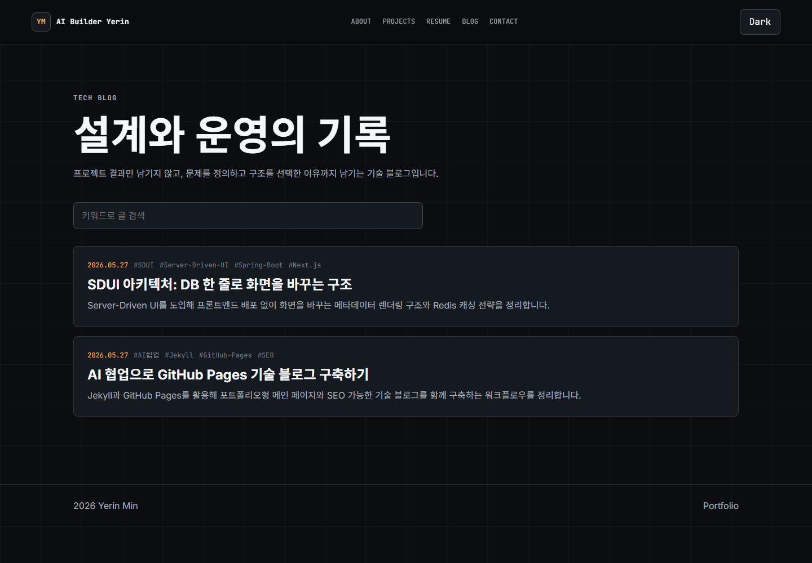
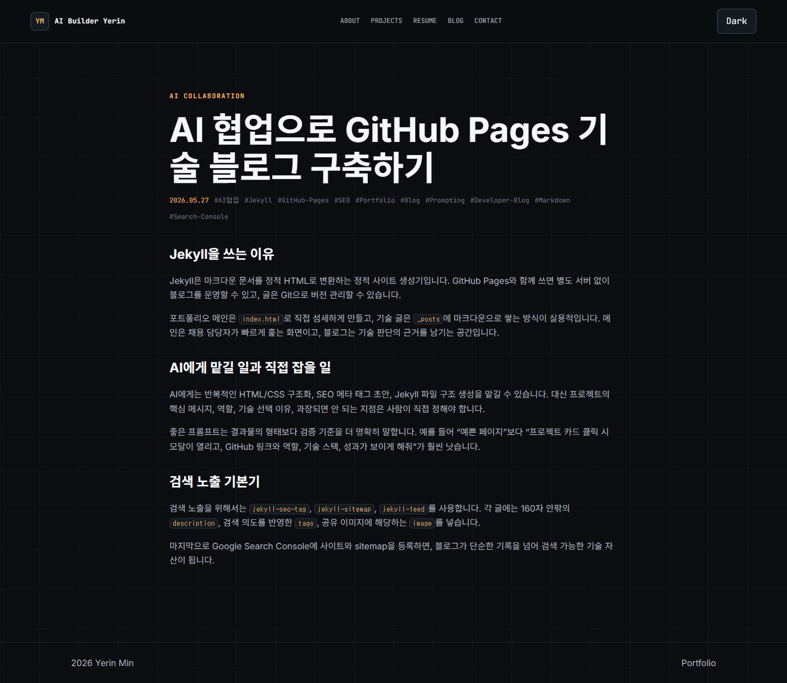
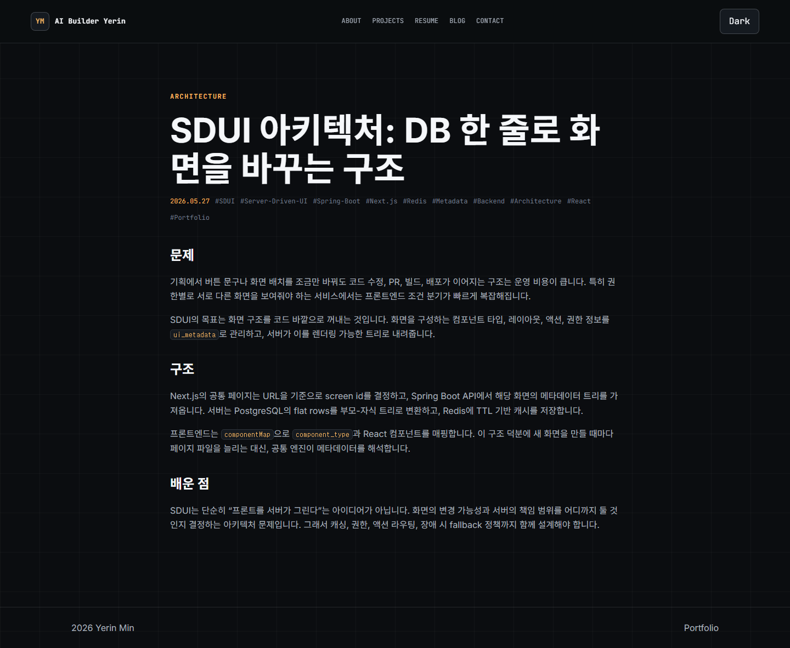

# Yerin Min - AI Builder & Architect Portfolio

비즈니스 로직과 AI를 연결하는 융합형 풀스택 개발자, 민예린의 포트폴리오 및 기술 블로그입니다.



## 📌 주요 화면 (Screenshots)

### 1. 포트폴리오 메인 (Home & Portfolio)
다크 모드와 고급스러운 타이포그래피를 적용하여 프리미엄 느낌을 주는 포트폴리오 랜딩 페이지입니다.

### 2. 기술 블로그 (Tech Blog)
AI와 백엔드 아키텍처에 대한 깊이 있는 고민을 담은 블로그입니다.


### 3. 블로그 포스트 (Posts)
- **AI Collaboration**: AI 페어 프로그래밍을 활용한 작업 후기 및 협업 노하우


- **SDUI Architecture**: Server-Driven UI 아키텍처 설계와 구현


---

## 🚀 Local preview (로컬 실행 방법)

Ruby와 Bundler가 설치되어 있어야 합니다.

```bash
bundle install
bundle exec jekyll serve --livereload
```

브라우저에서 `http://localhost:4000`으로 확인합니다.

## 📁 Structure (폴더 구조)

- `index.html`: 인터랙티브 포트폴리오 메인
- `blog/index.html`: Jekyll 블로그 목록
- `_posts/`: 기술 블로그 글
- `assets/css/styles.css`: 공통 스타일
- `assets/js/site.js`: 프로젝트 카드, 모달, 검색, 테마 전환
